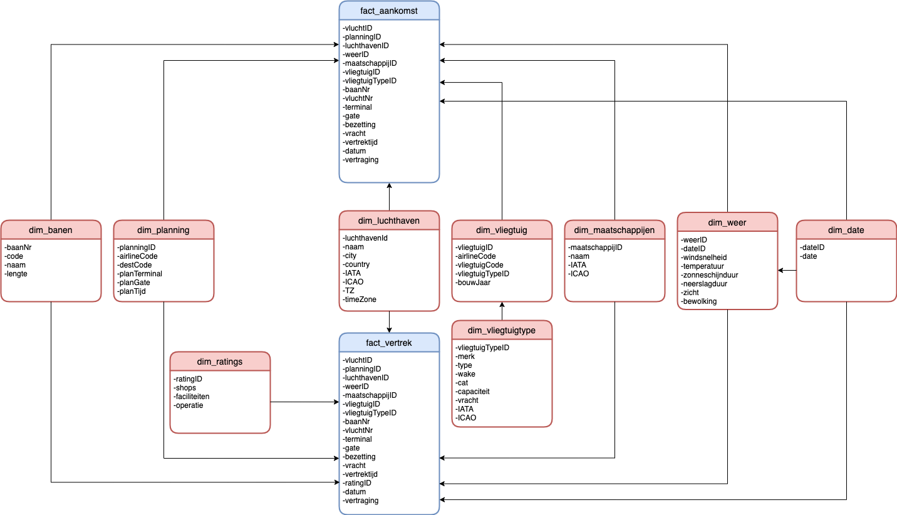

# Toegepaste Informatica

## Analyse Vision Airport

Onderdeel van Integrated Project Big Data
ondersteund door de
_Artesis Plantijn Hogeschool_
**Senne Bels, Lenny Bontenakel, Youssef El Boujeddainim & Prem Kokra**

---

# Opdrachtgever

De opdrachtgever van dit project is Ordina. Ordina is een Nederlands bedrijf dat over de hele Benelux kantoren heeft. Ze focussen zich voornamelijk op het bouwen en beheren van oplossingen voor de automatisering van bedrijfsprocessen en ICT.

Bij Ordina hebben we verschillende contactpersonen die elk hun kennis hebben in een ander onderwerp. We hebben contact gehad met **Aron Geerts**.

Dries Van Hansewijck, lector van AP Hogeschool, zal het project opvolgen en het nodige platform voorzien.

# Samenvatting

VisionAirport is al jaren verwikkeld in een steekspel op zoek naar de maximale groei. De vraag naar vluchten neemt elk jaar weer toe, ondanks enkele tegenslagen die de luchtvaartsector de laatste jaren heeft gehad zoals COVID. Steeds meer factoren krijgen invloed op de toekomst van VisionAirport. De internationale verhoudingen veranderen en zaken als geluidshinder en milieuvervuiling spelen een steeds grotere rol.

# Situatie As-Is

## Probleemstelling

Vision Airport is sinds enkele jaren een commerciële luchthaven, ze moeten dus verantwoording afleggen bij stakeholders, overheid en media. Deze informatie moet ook steeds meer en meer in detail zijn. Het verzamelen, groeperen en het rapporteren van de data is de verantwoordelijkheid van de afdeling “informatiemanagement”. Ze hebben op verschillende plaatsen in de organisatie databronnen. Hierdoor is het verzamelen en standaardiseren van de data een tijdrovend proces. Pas daarna kunnen ze beginnen aan het maken van rapporten en dashboards, waardoor ze maar zeer laat bij directie stakeholders en media terecht komen. Dit heeft invloed op de snelheid en accuraatheid waarmee men beslissingen kan maken.

# Situatie To-Be

## Doelstelling

Dit project gaat ervoor zorgen dat we de data centraliseren, uit de flat files halen en standardiseren waardoor er gelijk rapporten gemaakt kunnen worden. Om de snelheid van het maken van beslissing te acceleren zullen we naast het gebruik van een **data lake** om de rapporteringen te automatiseren ook nog een **Machine Learning toepassing** toevoegen aan het project.
Deze zal via verschillende tensorflow toepassingen een voorspelling maken van de klant ratings op basis van een aantal factoren en hyperparameters. Aangezien luchthavens hun brood verdienen aan klanten zal het model beduidend zijn voor de accuraatheid alsook de operationele snelheid van VisionAirport.

## Scope

- BI-platform
- Dashboard
- Rapportering
- Cleaning
- Exploration
- Technische Documentatie
- Datalake
- AI-model

## Niet in Scope

- Vooronderzoek
- Afbakening
- Architectuur- en infrastructuur analyse
- Infrastructuur implementatie
- Organisatorische implementatie
- Full-client

# Planning

| Hoofdlijn    | Deadline |
|--------------|----------|
| Sprint 1     |          |
| Analyse      | 14/12/21 |
| Notebook     | 14/12/21 |
| Sprint 2     |          |
| Rapportering | 21/12/21 |
| ML-model     | 21/12/21 |

## Toelichting Fases

1. **Analyse**:  
   We maken een blueprint waarin we een analyse maken van het project. De analyse moet een duidelijker beeld scheppen van het project.

2. **Design**:  
   We creëren een Proof of Concept (POC) waarop we in de volgende fase verder op kunnen bouwen.
   Deze POC zal ook een duidelijke weergave voorbrengen in verband met wat we zullen opleveren en hoe we dit willen realiseren.

3. **Construct**:  
   We ontwikkelen een dashboard en rapporteringen met AWS Quicksight alsook een ML-model dat voorspellingen zal doen.

4. **Turnover**:  
   Hier presenteren we onze bevindingen aan Ordina en lector Dries Van Hansewijck.

# Technisch Design

## Microservices

**AWS S3**  
Er zullen S3 buckets gebruikt worden om de parquet files op te slaan. Deze kunnen dan gebruikt worden door de andere AWS services.

**AWS Athena**  
Om querries op de bestanden in de S3 buckets uit te voeren maken we gebruik van Athena.

**AWS Quicksight**  
Dashboards en rapportering worden gemaakt via AWS Quicksight.

## Machine Learning

**Python**  
Aangezien Python de meest gebruikte ML taal is gebruiken we deze. We zullen hier ook gebruik maken van een heleboel modules en libraries.

**Jupyter**  
Het notebook bestand gebruikt Jupyter zodat we een mooi overzicht kunnen krijgen van de data via de inline plotting.

**Matplotlib**  
Zowel de lokale data als de data die vanuit AWS komt zal in grafieken gezet worden via matplotlib.

**Pyspark**  
Om de csv en txt bestanden om te zetten naar parquet bestanden om te zetten gebruiken we pyspark. Dit zal ook een belangrijke communicatielaag zijn tussen AWS en de lokale notebook.

**Tensorflow**  
Om uiteindelijk het AI-model te trainen zullen we gebruik maken van de talrijke op voorhand geconfigureerde tensorflow machine learning modellen zoals keras.

## Teksteditor

**VSCode**
De bekende IDE VSCode is een perfect fit voor dit project. Aangezien het een Open Source IDE is zijn er enorm veel extensions die ons zullen helpen tijdens het project zoals bijvoorbeeld de Jupyter notebook integration extension.

# Functioneel Design

## Data lake

Om veelzijdigheid in de rapporteringen te krijgen zullen we gebruik maken van een **Data Lake**. Deze zal gegenereerd worden uit een relationele database -- gemaakt via AWS Athena. Uiteindelijk zal deze data lake dan gequerried kunnen worden op een myriade van verschillende filters en tabellen. Hierdoor zullen we een zo specifiek mogelijk beeld kunnen geven omtrent een business operation of trend. De verschillende tabellen op welke gefilterd kan worden:

| Aankomsten     | Vertrek       |
|----------------|---------------|
| Banen          | Vliegtuig     |
| Klanten        | Vliegtuigtype |
| Luchthavens    | Vlucht        |
| Maatschappijen | Weer          |
| Planning       |               |

### Data lake schema

     
# Impact op huidige infrastructuur

Zoals beschreven staat in de ‘AS-IS Situatie’ moet VisionAirport hun data uit verschillende locaties halen.
Aangezien deze data nu opgeslagen zal worden in een centrale data lake binnen **AWS**
zal het voor VisionAirport niet nodig zijn om een server aan te kopen en is er dus geen impact op de huidige infrastructuur.
